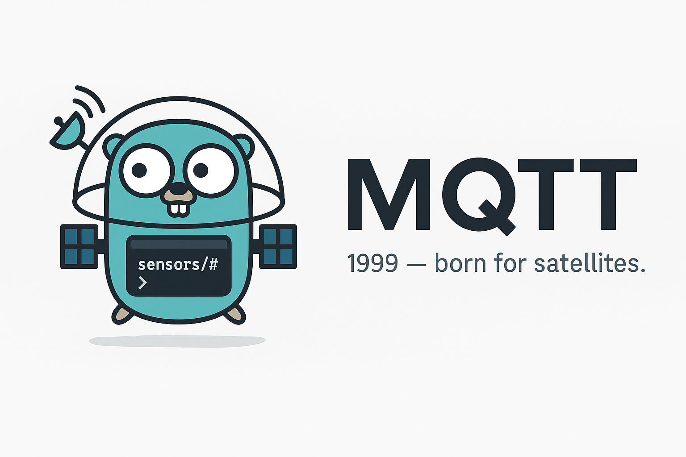
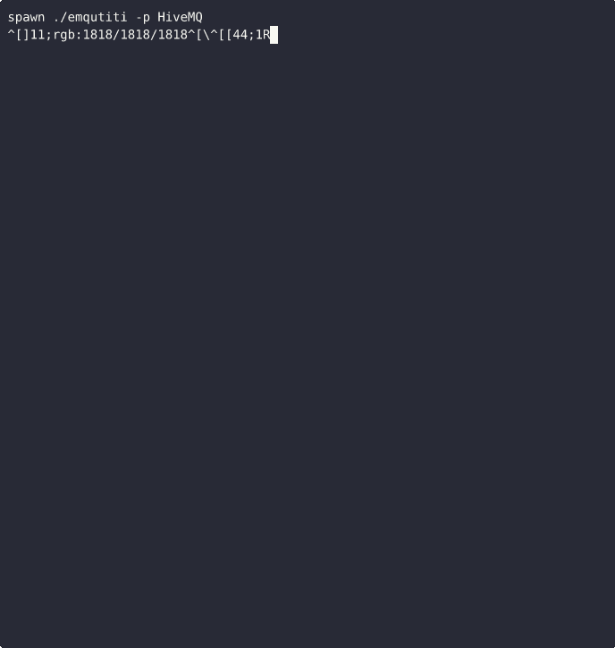

# Emqutiti



Emqutiti is a polished MQTT client for the terminal built on
[Bubble Tea](https://github.com/charmbracelet/bubbletea). Profiles live in
`~/.config/emqutiti/config.toml` so you can switch brokers with a few key presses.

## The short demo below shows the app in action.

### Add a new connection


### Connect to broker, add new topic, create message



## Features

- Slick interface for publishing and subscribing
- Manage multiple brokers with one config file
- Credentials stored securely via the OS keyring
- Import CSV files with a friendly wizard
- Persistent history and trace recording, even headless

## Installation
### From Source
```bash
go install github.com/marang/emqutiti/cmd/emqutiti@latest
```

### Arch Linux
```bash
yay -S emqutiti
```

## Usage

```bash
emqutiti
```

If a profile is marked as default, the app connects to it automatically on start.

### Importing from CSV

Launch `emqutiti -i data.csv -p local` (or `--import data.csv --profile local`) to map columns to JSON and publish them. The wizard supports dry runs and will remember settings in future versions.

Press `Ctrl+R` in the UI to manage recorded traces.

### Headless tracing

Run traces without the UI:

```
emqutiti --trace run1 --topics "sensors/#" -p local
```

Flags:

General

- `-i, --import FILE` Launch import wizard with optional file path (e.g., `-i data.csv`)
- `-p, --profile NAME` Connection profile name to use (e.g., `-p local`)

Trace

- `--trace KEY` Trace key name to store messages (e.g., `--trace run1`)
- `--topics LIST` Comma-separated topics to trace (e.g., `--topics "sensors/#"`)
- `--start TIME` Optional RFC3339 start time (e.g., `--start "2025-08-05T11:47:00Z"`)
- `--end TIME` Optional RFC3339 end time (e.g., `--end "2025-08-05T11:49:00Z"`)

Times must be RFC3339 formatted.

Example scheduled run:

```
emqutiti --trace myrun --topics "sensors/#" -p local --start "2025-08-05T11:47:00Z" --end "2025-08-05T11:49:00Z"
```

Traces are stored under `~/.config/emqutiti/data/<profile>/traces` and can
be viewed in the application (run `emqutiti` and press `CTRL+R` in the app
to view traces).

## Configuration
Profiles and proxy settings live in `~/.config/emqutiti/config.toml`. Other
clients read the `proxy_addr` field to locate the gRPC database proxy. If it is
missing, the app starts one on `127.0.0.1:54321` and records the chosen
address.

Minimal config example:

```toml
proxy_addr = "127.0.0.1:54321"
default_profile = "local"

[[profiles]]
name     = "local"
schema   = "tcp"
host     = "localhost"
port     = 1883
username = "user"
password = "keyring:emqutiti-local/user"
```

Tips:
- `schema` can be `mqtt`, `mqtts`, `tcp`, `ssl`, `ws`, or `wss`.
- More options like TLS and session settings are available; see the `config` package for details.
- Set `random_id_suffix = true` for unique client IDs.
- Set `skip_tls_verify = true` to bypass TLS certificate checks (useful for self-signed brokers).
- Use `ca_cert_path`, `client_cert_path`, and `client_key_path` to specify TLS certificates.
- Enable **Load from env** to read variables such as `EMQUTITI_LOCAL_SKIP_TLS_VERIFY` or `EMQUTITI_LOCAL_BROKER_PASSWORD`.

- Set `EMQUTITI_DEFAULT_PASSWORD` to override profile passwords when not loading from env.
- Set `default_profile` to auto-connect on launch. Use `Ctrl+O` in the broker manager to toggle it.

### Shortcuts

#### Global

| Action | Key |
| --- | --- |
| Exit the program | `Ctrl+D` |
| Manage payloads | `Ctrl+P` |
| Manage topics | `Ctrl+T` |
| Manage traces | `Ctrl+R` |
| Open broker manager | `Ctrl+B` |
| Disconnect from broker | `Ctrl+X` |
| Publish message | `Ctrl+S` |
| Publish retained message | `Ctrl+E` |
| Open log viewer | `Ctrl+L` |
| Resize panels | `Ctrl+Shift+Up` / `Ctrl+Shift+Down` |
| Scroll view | `Up`/`Down` or `j`/`k` |

#### Navigation

| Action | Key |
| --- | --- |
| Back | `Esc` |
| Cycle focus | `Tab` / `Shift+Tab` |
| Scroll view | `Up`/`Down` or `j`/`k` |
| Switch pane | `Left` / `Right` |

#### Broker Manager

- `x` disconnects the selected profile
- `Ctrl+O` toggles the default profile

#### History View

| Key | Action |
| --- | ------ |
| Space | Toggle selection |
| Shift+Up / Shift+Down | Extend selection |
| Ctrl+A | Select all |
| Ctrl+C | Copy selected history entries |
| a | Archive selected messages |
| Delete | Remove selected messages |
| / | Filter messages |
| Ctrl+F | Clear all history filters |
| Enter | View full message |

Retained messages are labeled "(retained)".

## License

This project is licensed under the terms of the MIT License. See [LICENSE](LICENSE) for details.

## Testing

Unit tests run quickly offline with `go test ./...`; network calls are
stubbed (the TLS client tests spin up a temporary loopback server).

The example `ExampleSet_manual` in `keyring_util_test.go` touches the real
system keyring and is skipped by default. Run it only when a keyring is
available:

```bash
go test -run ExampleSet_manual -tags manual
```

Tests also cover configuration parsing and saved state persistence.

Before sending a pull request run `go vet ./...` along with the tests to catch
common mistakes.

Additional notes for repository contributors are available in [AGENTS.md](AGENTS.md).

## Development

### Building

`make build` compiles the `emqutiti` binary using:

```bash
go build -trimpath -ldflags="-s -w" -o emqutiti ./cmd/emqutiti
```

### Common tasks

- `make build` – compile the `emqutiti` binary
- `make test` – run `go vet` and unit tests
- `make proto` – regenerate gRPC code from `proxy/proxy.proto`
- `make tape` – record demos via `docs/scripts/Dockerfile.vhs`

### Creating documentation

#### Recording demos for new features and howtos

Run `make tape` to build the helper image and execute
`docs/scripts/record_tapes.sh`. The image bundles `ffmpeg` and `ttyd`, which
VHS uses to render GIFs. Tape and GIF files are written to `docs/`. You can
regenerate individual GIFs with:

```bash
vhs -o docs/assets/create_connection.gif docs/create_connection.tape
```
You'll interact with the TUI inside the container just like running it locally.

